<div align="center">

# Omar Ahmed


<br/>

[](https://github.com/Omarahmed1925)
[](https://github.com/Omarahmed1925?tab=followers)
[](mailto:oa718307@gmail.com)

</div>

---

## About Me

```yaml
name: Omar Ahmed
location: Cairo, Egypt
focus:
  - Flutter & mobile engineering
  - Java / backend development
  - AI & machine learning
currently_building:
  - Ambient — AI-powered indoor navigation for university campuses
learning:
  - Data science & ML engineering
  - System design
  - Security & distributed systems
```

I enjoy turning ideas into clean, maintainable products and learning the engineering decisions behind them — not just making code work.

---

## Tech Stack

<div align="center">


</div>

---

## Featured Repositories

<table>
<tr>
<td width="50%" valign="top">

### ATM-SIM
Java ATM simulation project.

[](https://github.com/Omarahmed1925/ATM-SIM)
[](https://github.com/Omarahmed1925/ATM-SIM)

[View repository →](https://github.com/Omarahmed1925/ATM-SIM)

</td>
<td width="50%" valign="top">

### LearningManagementSystem
Java-based learning management system.

[](https://github.com/Omarahmed1925/LearningManagementSystem)
[](https://github.com/Omarahmed1925/LearningManagementSystem)

[View repository →](https://github.com/Omarahmed1925/LearningManagementSystem)

</td>
</tr>

<tr>
<td width="50%" valign="top">

### Islami
Flutter application built with Dart.

[](https://github.com/Omarahmed1925/Islami)
[](https://github.com/Omarahmed1925/Islami)

[View repository →](https://github.com/Omarahmed1925/Islami)

</td>
<td width="50%" valign="top">

### newsApp
Flutter news application.

[](https://github.com/Omarahmed1925/newsApp)
[](https://github.com/Omarahmed1925/newsApp)

[View repository →](https://github.com/Omarahmed1925/newsApp)

</td>
</tr>
</table>

---

## Live GitHub Analytics

<!-- These SVGs are generated by the included GitHub Action every 24 hours. -->

<div align="center">



<br/>




<br/>




</div>

---

## Contribution Activity

<div align="center">


</div>

---

## Contribution Snake

<picture>
  <source media="(prefers-color-scheme: dark)" srcset="https://raw.githubusercontent.com/Omarahmed1925/Omarahmed1925/output/github-contribution-grid-snake-dark.svg" />
  <source media="(prefers-color-scheme: light)" srcset="https://raw.githubusercontent.com/Omarahmed1925/Omarahmed1925/output/github-contribution-grid-snake.svg" />
  
</picture>

---

## Current Direction

- Building production-quality Flutter applications
- Strengthening Java and backend engineering
- Moving deeper into Data Science / ML Engineering
- Practicing algorithms, data structures, and problem solving
- Learning to design systems that are maintainable, testable, and scalable

---

<div align="center">

### Build. Learn. Refine. Repeat.

<sub>Thanks for visiting my profile.</sub>

</div>
