<p align="center">
  <a href="https://github.com/Omarahmed1925">
    
  </a>
</p>

<p align="center">
  <a href="https://github.com/Omarahmed1925"></a>
  <a href="mailto:oa718307@gmail.com"></a>
</p>

<p align="center">
  
</p>

---

## `~/` whoami

```console
$ cat about.txt
```

Hi, I'm **Omar Ahmed Anwar**, a Software Engineer and Computer Science & Artificial Intelligence graduate from **Cairo University**, with a concentration in **Software Engineering**.

- Focused on **Java backend development** and **Flutter mobile engineering**
- Experienced with **microservices, REST APIs, RabbitMQ, multithreading, socket programming, and distributed systems**
- Build mobile applications using **Flutter, Clean Architecture, BLoC/Cubit, Firebase, and REST APIs**
- Currently strengthening my backend stack through advanced **Java and Spring Boot** development

---

<h2 align="center"><code>~/</code> toolbox</h2>

<p align="center">
  
</p>

---

<h2 align="center"><code>~/</code> skill radar</h2>

<table>
<tr>
<td width="50%" align="center" valign="middle">
  <picture>
    <source media="(prefers-color-scheme: dark)" srcset="assets/radar-dark.svg">
    <source media="(prefers-color-scheme: light)" srcset="assets/radar-light.svg">
    
  </picture>
</td>
<td width="50%" align="center" valign="middle">
  <picture>
    <source media="(prefers-color-scheme: dark)" srcset="assets/radar-langs-dark.svg">
    <source media="(prefers-color-scheme: light)" srcset="assets/radar-langs-light.svg">
    
  </picture>
</td>
</tr>
</table>

---

<h2 align="center"><code>~/</code> contribution calendar</h2>

<p align="center">
  
</p>

<p align="center">
  <picture>
    <source media="(prefers-color-scheme: dark)" srcset="https://raw.githubusercontent.com/Omarahmed1925/Omarahmed1925/output/snake-dark.svg">
    <source media="(prefers-color-scheme: light)" srcset="https://raw.githubusercontent.com/Omarahmed1925/Omarahmed1925/output/snake.svg">
    
  </picture>
</p>

---

<h2 align="center"><code>~/</code> the numbers</h2>

<p align="center">
  
</p>

<p align="center">
  
</p>

---

<h2 align="center"><code>~/</code> selected work</h2>

### On-Demand Home Services Marketplace Platform
`Java` `EJB` `RabbitMQ` `Microservices` `REST API`

Distributed marketplace connecting customers with service professionals. Built independent services with separate codebases and databases, wallet-based booking with rollback on failure, asynchronous RabbitMQ confirmations, and administrative transaction and booking management.

### Multiplayer Trivia Game
`Java` `Socket Programming` `Multithreading`

Concurrent client-server trivia game supporting single-player and team multiplayer modes, authentication, real-time countdowns, categorized question banks, scoring, match history, and graceful handling of disconnects and invalid input.

### Ambient
`Flutter` `Dart` `BLE` `Mapbox` `Supabase` `Clean Architecture`

AI-powered indoor campus navigation application using BLE beacon triangulation and Kalman filtering for real-time positioning, multi-floor routing, interactive indoor maps, offline caching, academic scheduling, and a location-aware AI chatbot.

### MoviesApp
`Flutter` `Dart` `Clean Architecture` `BLoC` `REST API`

Movie discovery application with trending, popular and top-rated content, genre filtering, detailed movie information, trailers, external links, and keyword search.

---

<p align="center">
  <sub>Backend Engineering • Mobile Development • Distributed Systems • Clean Architecture</sub>
</p>
